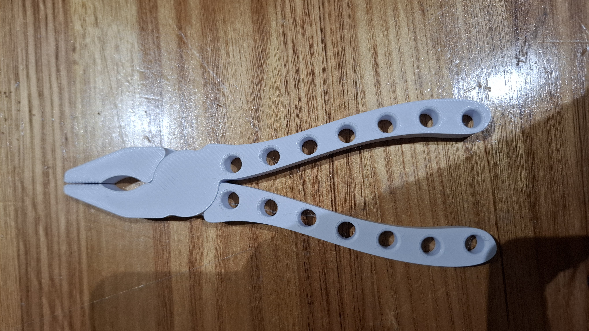

# Topology-Optimized 3D-Printed Pliers

A single-piece, print-in-place PLA pliers designed for material extrusion (FDM) 3D printing, engineered under a 25 g mass budget with force-to-weight ratio as the primary optimization target.

Designed for **UTS 41302 — Additive Manufacturing 1**, Project 2. Printed on a Bambu Lab P2S at UTS ProtoSpace.

## Overview

Traditional pliers are designed for subtractive/assembled manufacturing — separate jaws, a pivot pin, and a fastener. This project rethinks the form specifically for FDM: a **monolithic, print-in-place mechanism** with no post-print assembly, where the pivot is a captured pin-and-hole joint printed with clearance in a single build.

The macro geometry was derived using **Fusion 360's Shape Optimization** (topology optimization) rather than Generative Design — a chunky, over-engineered starting body was iteratively refined against FEA-derived stress data until it met a target safety factor, rather than letting the solver auto-generate the form. This kept the result parametric, clean, and directly printable.

## Design & Engineering Process

1. **Starting geometry** — an intentionally over-engineered "blank" containing the pivot, jaw zones, and grip pads at final dimensions, with surplus material in the handle webs for the optimizer to remove.
2. **Static Stress study** — three load cases (handle squeeze via remote moment, jaw-tip reaction force, off-axis grip) applied in Fusion's Simulation workspace with a custom PLA material definition (density 1.24 g/cm³, yield strength 35 MPa).
3. **Shape Optimization study** — inherited loads/constraints from the static study; targeted mass minimization with preserved regions at the pivot, jaw faces, and grip pads.
4. **Manual re-modeling** — rather than exporting the optimizer's raw mesh, the density/stress plots were used as a guide to manually re-model the handles parametrically, producing the through-hole lattice pattern visible in the final part.
5. **Validation loop** — the first design iteration failed (**Safety Factor 0.63** — predicted to bend or break). Handle webs near the pivot were thickened and re-validated, passing at **Safety Factor 3.46** (target: 3.00).

| Metric | Value |
|---|---|
| Final mass | 24.76 g (target ≤ 25 g) |
| Minimum safety factor | 3.46 (target ≥ 3.00) |
| Mass removed by optimization | ~35% (Mass Ratio 65.06%) |
| Print orientation | Flat-lay (XY plane), pivot axis vertical |
| Pivot mechanism | Print-in-place captured pin + hole, 0.25 mm clearance |
| Estimated print time | ~1 h 3 min (single part) |

## Key Design Decisions

- **Flat-lay print orientation** — chosen so bending loads run along bead direction rather than across layer interfaces, where FDM PLA loses the majority of its tensile strength. This was the single highest-impact decision for strength-to-weight.
- **5 wall loops, low sparse infill (Gyroid, ~4%)** — walls carry the structural load in a thin-walled part; infill contributes comparatively little strength once wall count is sufficient, so density was kept low to save mass.
- **Print-in-place pivot** over a compliant flexure hinge — PLA fatigues rapidly under cyclic bending; a pin-in-shear joint keeps the material in its strongest loading mode.
- **Multi-zone jaw** — front serrations, a mid-jaw 90° V-groove, and a rear flat clamping surface, to grip a range of item geometries and materials rather than relying on a single tooth profile.

## Repository Contents

| File | Description |
|---|---|
| `Pliers Side (Assembly).f3z` | Native Fusion 360 archive — includes the Static Stress and Shape Optimization studies, timeline history, and parametric model |
| `Pliers Side (Assembly).SLDASM` / `.SLDPRT` | SolidWorks-compatible export of the final assembly/part |
| `Pliers Side (Assembly).step` | Neutral CAD interchange format |
| `AdditiveGroupPlate.3mf` | Bambu Studio project file, includes the ProtoSpace P2S print profile and slicer settings |
| `AdditiveGroupPlate_plate_1.gcode.3mf` | Sliced G-code ready to print on a Bambu Lab P2S |
| `Technical video.mp4` | 2-minute technical explainer covering design reasoning and sustainability considerations |
| `LICENSE` | License terms for this repository |

## Print Settings

- **Printer:** Bambu Lab P2S, 0.4 mm nozzle
- **Material:** PLA Basic
- **Layer height:** 0.20 mm
- **Wall loops:** 5
- **Infill:** Gyroid, ~4%
- **Orientation:** Flat in XY, pivot axis vertical
- **Supports:** Tree (auto), as needed for the print-in-place clearance gap

## Tools Used

- Autodesk Fusion 360 — parametric CAD, Static Stress simulation, Shape Optimization (topology optimization)
- Bambu Studio — slicing, ProtoSpace-provided P2S configuration profile
- Bambu Lab P2S — fabrication

## Course Context

Completed as Project 2 for UTS 41302 Additive Manufacturing 1 (Autumn 2026), part of the Mechatronics Engineering (Honours) program at the University of Technology Sydney. The brief required a topology-optimized or generatively-designed, single-piece, print-in-place PLA tool meeting strength, ergonomic, and functional criteria under a 25 g mass limit.

## License

See [LICENSE](LICENSE) for terms.

## Author

Abhi Naglapura — [abhinaglapura.com](https://abhinaglapura.com) · [github.com/abhi-243](https://github.com/abhi-243)